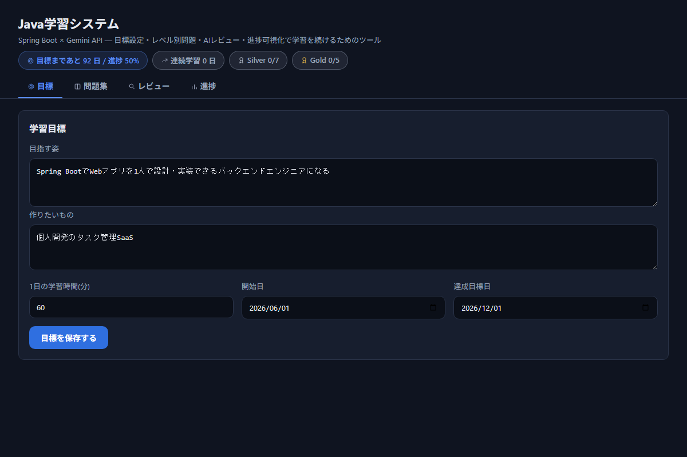
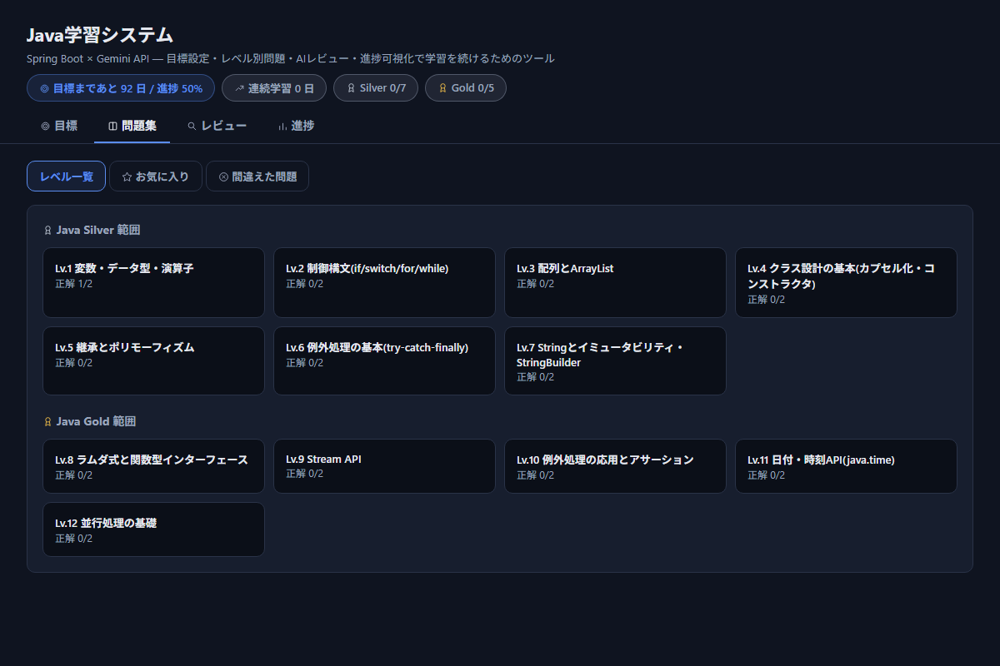
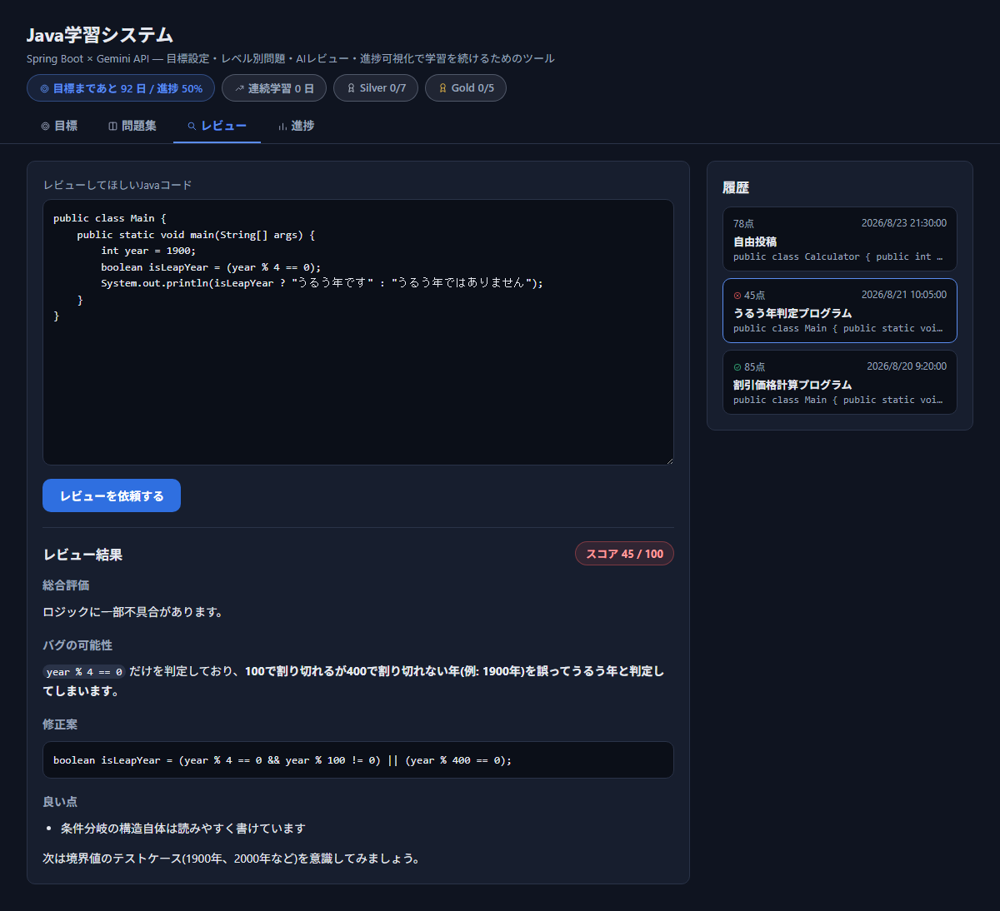
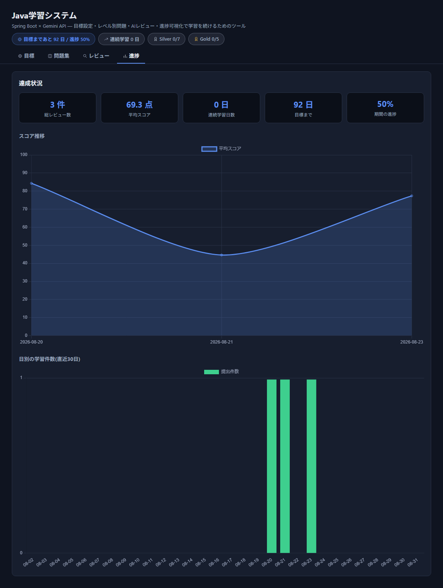

# Java学習システム

[](https://github.com/mahiro770/reviewBot/actions/workflows/ci.yml)

Spring Boot + Gemini API で、Javaの学習を「目標設定 → 毎日の問題 → AIレビュー → 進捗の可視化」の
サイクルで継続できるようにする学習用アプリです。Gemini APIは無料枠があるため、学習用途であれば
費用をかけずに使えます。

```
ブラウザ(静的HTML/JS、Chart.jsはCDN経由)
   ↓
Controller (Goal / Level / Problem / Review / Stats Controller)
   ↓
Service (GoalService, GeminiProblemService, GeminiReviewService, StatsService) --- Gemini API
   ↓
Repository (GoalRepository, ProblemRepository, ReviewRepository / JdbcTemplate)
   ↓
SQLite (review.db) ← 起動時に SchemaMigrator が db/migration/V*.sql を適用
```

Controller → Service → Repository → DB という、これまで学習してきた構成そのままで、
「Spring BootからAPIを呼ぶ」経験が積めるように作っています。JPAは使わず、
これまで慣れているJDBC(Spring版のJdbcTemplate)でSQLiteにアクセスしています。

## できること

4つのタブで構成されています。ヘッダーには常に「目標まであとN日」「🔥連続学習日数」
「🥈Silver進捗」「🥇Gold進捗」が表示されます。

- **🎯 目標**: 「目指す姿」「作りたいもの」「1日の学習時間」「達成目標日」を登録します。
- **📚 問題集**: Java Silver / Gold(Oracle認定資格)の出題範囲に沿った全12レベル
  (Silver 7 + Gold 5、`levels` テーブルに保存)から選んで、Geminiにその場で問題を生成してもらえます。
  1回の生成で1/3/5/10問をまとめて作成できます(デフォルト5問、最大10問。1回のAPI呼び出しで
  まとめて生成するので、問題数を増やしてもAPIの呼び出し回数は増えません)。
  回答を提出すると、スコアに加えて「✅正解 / ❌不正解」も判定されます。
  そのレベルで2問以上「正解」判定されるとレベルクリア扱いになります(1問だけだと「たまたま」の
  可能性があるため)。「⭐お気に入り」「❌間違えた問題」から横断的に見返すこともできます。
- **📝 レビュー**: テキストエリアにJavaコードを貼り付けて「レビューを依頼する」を押すと、Geminiが
  バグの可能性・設計/可読性・Javaのベストプラクティス・良い点・次に学ぶと良いことをレビューし、
  100点満点のスコアを返します。右側の「履歴」から過去のレビューをいつでも見返せます。
- **📊 進捗**: 総レビュー数・平均スコア・連続学習日数・目標までの残り日数と進捗率をタイル表示し、
  スコア推移(折れ線)と直近30日の学習件数(棒グラフ)をChart.jsで可視化します。

レビュー結果・目標・生成した問題はすべてSQLiteに保存され、アプリを再起動しても保持されます。

## スクリーンショット

(掲載画像は動作確認用のダミーデータで撮影しています)

### 🎯 目標設定


### 📚 レベル別問題集


### 📝 AIレビュー(バグ検出の例)
実際にGeminiが「うるう年判定で100年区切りの例外処理が漏れている」バグを指摘した例です。


### 📊 進捗の可視化


## 事前準備

- JDK 17以上 (`java -version` で確認)
- Maven (`mvn -version` で確認。使っていなければ [Maven公式](https://maven.apache.org/download.cgi) からインストール)
- Gemini APIキー(無料)。[Google AI Studio](https://aistudio.google.com/apikey) にGoogleアカウントで
  ログインして発行してください。無料枠にはレート制限がありますが、個人の学習用途なら十分です。
- 進捗タブのグラフ描画にChart.jsをCDN経由で読み込むため、ブラウザからインターネット接続が必要です。

## 起動方法

1. プロジェクトを展開したフォルダに移動する

   ```
   cd java-review-bot
   ```

2. APIキーを環境変数に設定する

   **Windows (コマンドプロンプト)**

   ```
   set GEMINI_API_KEY=xxxxxxxxxxxxxxxx
   ```

   **Windows (PowerShell)**

   ```
   $env:GEMINI_API_KEY="xxxxxxxxxxxxxxxx"
   ```

   **macOS / Linux**

   ```
   export GEMINI_API_KEY=xxxxxxxxxxxxxxxx
   ```

   ※このウィンドウ/ターミナルを閉じると設定が消えるので、毎回設定するか、
   OSの環境変数設定に恒久的に登録してください。

3. アプリを起動する

   ```
   mvn spring-boot:run
   ```

4. ブラウザで `http://localhost:8080` を開く

初回起動時に `review.db` というSQLiteファイルがプロジェクト直下に自動生成されます。
起動のたびに `SchemaMigrator` が `src/main/resources/db/migration/V*.sql` を
バージョン番号順に、まだ適用していないものだけ実行します(適用済みバージョンは
`schema_version` テーブルに記録されます)。このファイルにレビュー履歴・目標・
生成した問題が溜まっていきます。

## 使い方のコツ

- テキストエリアにフォーカスした状態で `Ctrl + Enter` (Macは `Cmd + Enter`) でも送信できます。
- 使うモデルは `src/main/resources/application.properties` の `gemini.api.model` で変更できます
  (無料枠で使えるモデルの範囲で選んでください)。
- レビューの観点(何を見てほしいか)は `GeminiReviewService` の `SYSTEM_PROMPT` を書き換えることで
  自由にカスタマイズできます。例えば「Spring Bootの設計原則も見てほしい」のように追記してみてください。
- 問題集の出題傾向(テーマの選び方や難易度の書き方)は `GeminiProblemService` の `SYSTEM_PROMPT` で
  カスタマイズできます。レベルの一覧・出題範囲は `levels` テーブル(`db/migration/V2__levels.sql` で
  投入)に入っているので、コードを変更しなくても行を直接編集すれば内容を変えられます。
- スキーマを変更したい場合は `src/main/resources/db/migration/` に
  `V3__xxx.sql` のような新しいファイルを追加してください(既存のV1/V2は変更しない)。
- レビュー履歴・問題一覧・お気に入り・間違えた問題は20件ずつページングされます
  (`limit`/`offset` クエリパラメータ、フロントには「もっと見る」ボタン)。
- Gemini APIへのリクエストは `GeminiClient` に集約されており、429(レート制限)や5xxエラーは
  指数バックオフで自動的に数回リトライします。
- 目標は常に最新の1件が「現在の目標」として扱われます(履歴管理はしていません)。目標タブで再保存すると
  新しい目標に上書きされます。
- Gemini無料枠のレート制限(1分あたりのリクエスト数など)に達すると、レビュー/問題生成がエラーになる
  ことがあります。少し待ってから再度お試しください。

## テストの実行

```
mvn test
```

Repository層はSQLiteのインメモリDB(`jdbc:sqlite::memory:`、`src/test/resources/application.properties`で設定)に
対する統合テスト、Service層のロジック(連続学習日数の計算、レベルクリア判定など)はMockitoを使った
単体テストになっています。

## 設計判断

なぜこの構成にしたか、判断の背景をまとめています。

### なぜJPAではなくJDBC(JdbcTemplate)か
学習目的のアプリのため、ORMに隠れずSQLを直接書く経験をあえて優先しました。JOINやN+1回避
(複数IDをまとめて取得する`findByProblemIds`/`findTitlesByIds`など)を自分の手で意識して
書けることを重視しています。

### なぜSQLiteか
個人利用・ローカル実行が前提のため、サーバー管理が不要な単一ファイルDBを選びました。
`review.db`をコピーするだけでバックアップ・移行ができます。

### Gemini APIとの向き合い方
- 構造化出力(`responseSchema`)でJSON配列を強制し、自由記述からの正規表現抽出は避けています
  (`GeminiProblemService` / `GeminiReviewService`)。
- 429(レート制限)/5xxエラーは`GeminiClient`に集約して指数バックオフで自動リトライし、
  無料枠のレート制限があることを前提にした設計にしています。
- 問題生成は1回のAPI呼び出しでN問まとめて作る設計にし、問題数を増やしてもAPI呼び出し回数が
  増えないようにしています。

### レベルクリア判定を「2問正解」にした理由
1問だけの正解では「たまたま」の可能性を排除できないため、複数問の正解を要求しています
(`LevelProgressService.REQUIRED_CORRECT_TO_CLEAR`)。

### 難易度の自動調整
そのレベルでの直近5件の正誤判定から正解率を計算し(`LevelProgressService.recentPerformance`)、
75%以上なら難易度を上げる、35%以下なら下げるようGeminiにソフトな指示(プロンプト内の文章)を
出しています(`GeminiProblemService`)。`difficulty`フィールドの選択肢自体は制約せず、
またレベル本来の出題範囲を優先させています。

## この状態からの発展アイデア

- 案件配信ツールと同じくSupabaseに繋ぎ変えて、履歴をクラウドに保存する
- ファイルアップロード(.javaファイル)に対応する
- Spring Securityでログイン機能を追加する
- 週次/月次のサマリーをGeminiにまとめてもらう機能を追加する
- レベル一覧・問題一覧をブラウザから編集できる管理画面を追加する(現状は`levels`テーブルを
  直接編集する必要がある)
